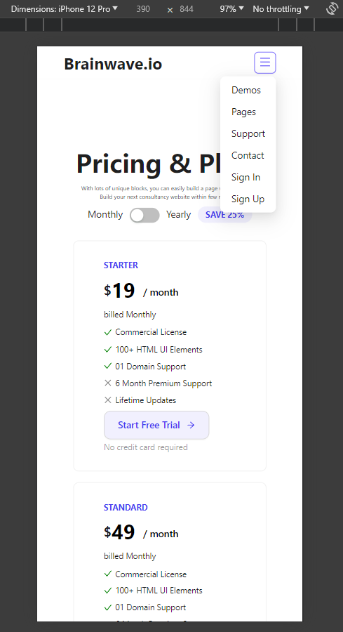
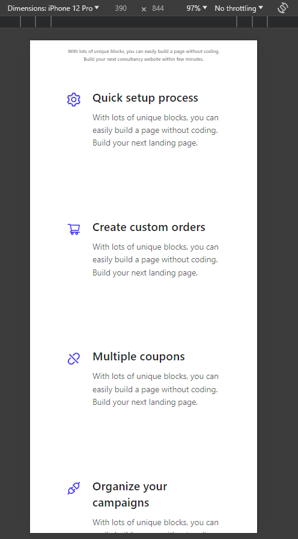
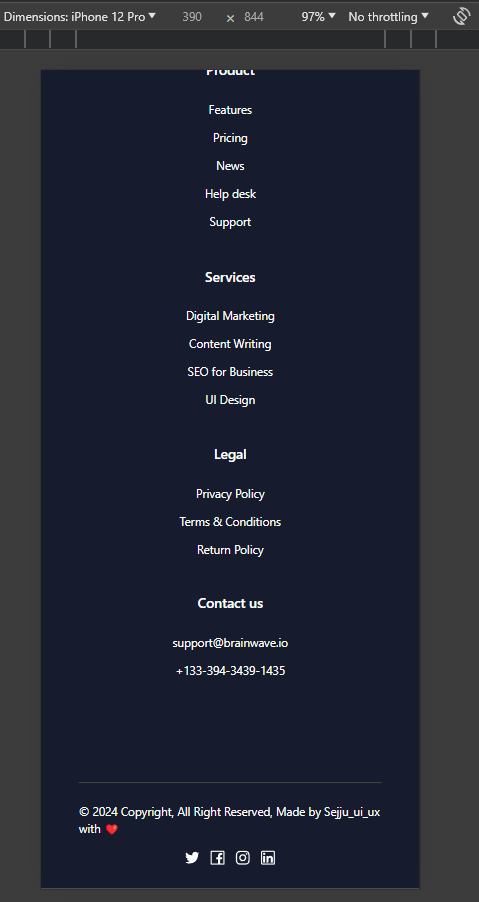

# umbrl: React/Next.js Engineer Task

This project is a frontend design task completed using React and Ant Design library in a TypeScript compilation environment, based on designs from Figma. It includes state management with Redux Toolkit, error page handling with react-router-dom, and responsive design techniques, etc.
<br />
<br />


<br />
<br />

## Table of Contents
- [Usage](#usage)
- [Introduction](#introduction)
- [Technologies In This Project](#technologies-in-this-project)
- [Demo](#demo)

## Usage
To run this project locally, follow these steps:

### Front End

Terminal
```sh
$ npm install
$ npm start
```

## Introduction
### Front End

#### Task Accomplishments

1. **Landing Screen:**
   - Implemented state management leveraging Redux Toolkit for "pricing&plans" state transitions.
   - Developed layouts that adapt to various screen sizes, ensuring a consistent user experience across devices.
   - Error handling with react-router-dom to manage 404 and 403 pages adpately.

2. **Navigation:**
   - Implemented navigation using react-router-dom.

3. **Design:**
   - Created a clean and user-friendly UI/UX using `Antd Design` library.
  

## Technologies In This Project
### Front End

1. React
2. Redux Toolkit
3. TypeScript
4. Antd Design
5. React-Router-Dom

## Demo
### Front End
<div align="center">
    
    
    
    
    
    
    
</div>

## Conclusion
Considering the email mentioned the suggested development duration of the project. If more time is available in the future, the plan would include backend development with Node.js and Koa.js for server-side rendering using Next.js through , and more responsive design. Besides, implement unit testing through React Jest framework.
